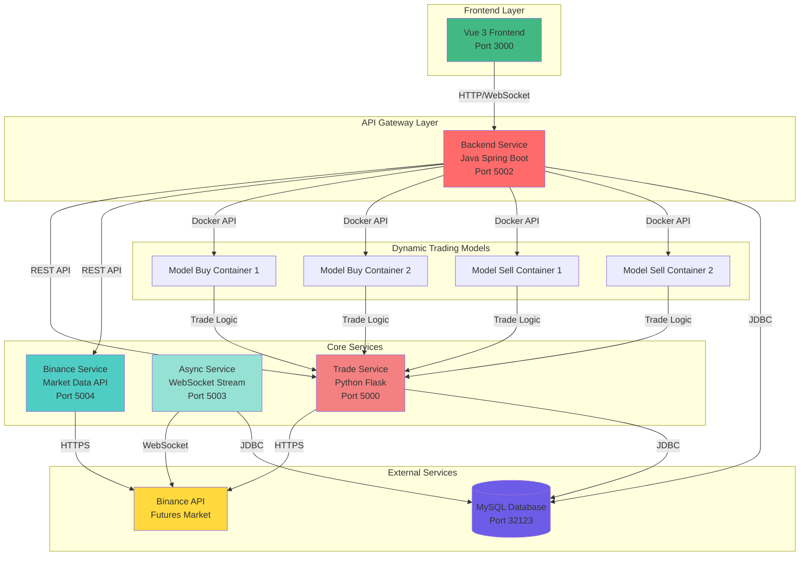

# AIFutureTrade - AI-Powered Cryptocurrency Futures Trading System

An intelligent automated trading system for Binance Futures, powered by AI and built with microservices architecture.

[English](#english) | [中文](#chinese)

---

## English

### 📋 Table of Contents

- [Overview](#overview)
- [Features](#features)
- [Architecture](#architecture)
- [Tech Stack](#tech-stack)
- [Quick Start](#quick-start)
- [Configuration](#configuration)
- [API Documentation](#api-documentation)
- [Development](#development)
- [Troubleshooting](#troubleshooting)
- [Contributing](#contributing)
- [License](#license)

### 🎯 Overview

AIFutureTrade is a comprehensive automated trading system designed for Binance Futures markets. It leverages AI-driven strategies, real-time market data processing, and a scalable microservices architecture to execute trades efficiently and manage risk effectively.

**Key Highlights:**
- 🤖 AI-powered trading strategies with dynamic model management
- 📊 Real-time market data streaming via WebSocket
- 🔄 Microservices architecture for scalability and maintainability
- 🐳 Fully containerized with Docker for easy deployment
- 📈 Interactive web interface with real-time K-line charts
- ⚡ High-performance async I/O for market data processing

### ✨ Features

#### Trading Features
- **AI-Driven Strategies**: Dynamic buy/sell models with independent container execution
- **Risk Management**: Position sizing, stop-loss, and take-profit automation
- **Multi-Symbol Support**: Trade multiple futures contracts simultaneously
- **Real-time Execution**: Low-latency order placement and management

#### Data Processing
- **WebSocket Streaming**: Real-time market ticker data from Binance
- **Historical Data**: K-line data storage and analysis
- **Technical Indicators**: Built-in TA-Lib integration for technical analysis
- **Data Persistence**: MySQL database for trade history and positions

#### System Features
- **Microservices Architecture**: Independent, scalable services
- **Dynamic Container Management**: Auto-scaling trading model containers
- **Health Monitoring**: Service status tracking and auto-restart
- **RESTful APIs**: Comprehensive API endpoints with Swagger documentation

### 🏗️ Architecture

#### System Architecture Diagram

