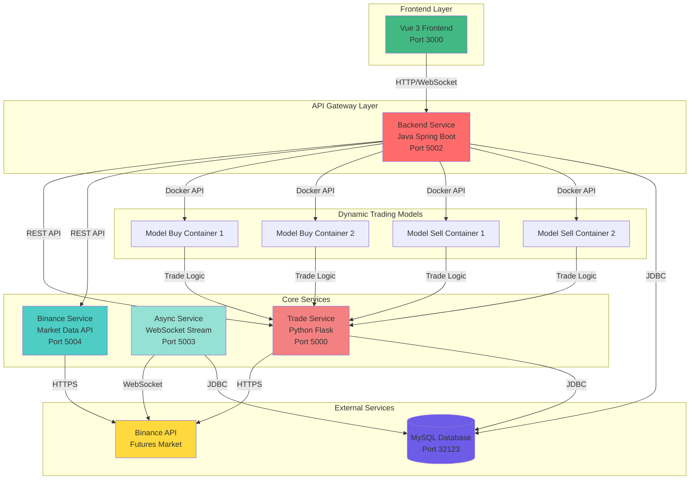
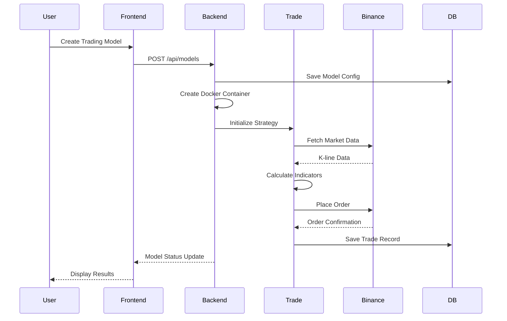

# AIFutureTrade - AI-Powered Cryptocurrency Futures Trading System

<div align="center">

[](LICENSE)
[](https://www.oracle.com/java/)
[](https://www.python.org/)
[](https://vuejs.org/)
[](https://www.docker.com/)

An intelligent automated trading system for Binance Futures, powered by AI and built with microservices architecture.

[English](#english) | [中文](#chinese)

</div>

---

## <a name="english"></a>English

### 📋 Table of Contents

- [Overview](#overview)
- [Features](#features)
- [Architecture](#architecture)
- [Tech Stack](#tech-stack)
- [Quick Start](#quick-start)
- [Configuration](#configuration)
- [API Documentation](#api-documentation)
- [Development](#development)
- [Troubleshooting](#troubleshooting)
- [Contributing](#contributing)
- [License](#license)

### 🎯 Overview

AIFutureTrade is a comprehensive automated trading system designed for Binance Futures markets. It leverages AI-driven strategies, real-time market data processing, and a scalable microservices architecture to execute trades efficiently and manage risk effectively.

**Key Highlights:**
- 🤖 AI-powered trading strategies with dynamic model management
- 📊 Real-time market data streaming via WebSocket
- 🔄 Microservices architecture for scalability and maintainability
- 🐳 Fully containerized with Docker for easy deployment
- 📈 Interactive web interface with real-time K-line charts
- ⚡ High-performance async I/O for market data processing

### ✨ Features

#### Trading Features
- **AI-Driven Strategies**: Dynamic buy/sell models with independent container execution
- **Risk Management**: Position sizing, stop-loss, and take-profit automation
- **Multi-Symbol Support**: Trade multiple futures contracts simultaneously
- **Real-time Execution**: Low-latency order placement and management

#### Data Processing
- **WebSocket Streaming**: Real-time market ticker data from Binance
- **Historical Data**: K-line data storage and analysis
- **Technical Indicators**: Built-in TA-Lib integration for technical analysis
- **Data Persistence**: MySQL database for trade history and positions

#### System Features
- **Microservices Architecture**: Independent, scalable services
- **Dynamic Container Management**: Auto-scaling trading model containers
- **Health Monitoring**: Service status tracking and auto-restart
- **RESTful APIs**: Comprehensive API endpoints with Swagger documentation

### 🏗️ Architecture

#### System Architecture Diagram



#### Service Responsibilities

| Service | Port | Technology | Responsibility |
|---------|------|------------|----------------|
| **Frontend** | 3000 | Vue 3 + Vite | User interface, real-time charts, WebSocket client |
| **Backend** | 5002 | Java 17 + Spring Boot | Main API, user/model management, Docker orchestration |
| **Binance Service** | 5004 | Java 17 + Undertow | High-performance Binance API proxy |
| **Async Service** | 5003 | Java 17 + Spring Boot | WebSocket streaming, scheduled tasks |
| **Trade Service** | 5000 | Python 3 + Flask | Trading logic, strategy execution, risk management |
| **Model Containers** | Dynamic | Python 3 | Independent buy/sell model execution |

#### Data Flow



### 🛠️ Tech Stack

#### Backend Services
- **Java 17**: Modern Java features and performance
- **Spring Boot 3.2.0**: Microservices framework
- **MyBatis Plus**: ORM and database operations
- **Undertow**: High-performance async I/O server
- **Docker Java API**: Dynamic container management

#### Trading Engine
- **Python 3**: Core trading logic
- **Flask**: RESTful API framework
- **Gunicorn + Eventlet**: Async worker management
- **TA-Lib**: Technical analysis library
- **Pandas/NumPy**: Data processing and analysis

#### Frontend
- **Vue 3**: Progressive JavaScript framework
- **Vite**: Next-generation build tool
- **KLineChart**: Professional K-line charting
- **Axios**: HTTP client
- **WebSocket**: Real-time data streaming

#### Infrastructure
- **MySQL 8.0**: Relational database
- **Docker**: Containerization
- **Docker Compose**: Multi-container orchestration
- **Git**: Version control

### 🚀 Quick Start

#### Prerequisites

- Docker 20.10+
- Docker Compose 2.0+
- Git
- Binance Futures API Key (for live trading)

#### Installation

1. **Clone the repository**
```bash
git clone https://github.com/yourusername/AIFutureTrade.git
cd AIFutureTrade
```

2. **Configure environment variables**
```bash
cp .env.example .env
# Edit .env with your configuration
```

3. **Start MySQL database**
```bash
docker-compose -f docker-compose-mysql.yml up -d
```

4. **Build and start all services**
```bash
./scripts/docker-compose-up.sh --build
```

5. **Access the application**
- Frontend: http://localhost:3000
- Backend API: http://localhost:5002
- Swagger UI: http://localhost:5002/swagger-ui.html

### ⚙️ Configuration

#### Environment Variables (.env)

```bash
# MySQL Configuration
MYSQL_HOST=your_mysql_host
MYSQL_PORT=32123
MYSQL_USER=aifuturetrade
MYSQL_PASSWORD=your_password
MYSQL_DATABASE=aifuturetrade

# Binance API
BINANCE_API_KEY=your_api_key
BINANCE_API_SECRET=your_secret_key

# Service Ports
BACKEND_PORT=5002
BINANCE_SERVICE_PORT=5004
ASYNC_SERVICE_PORT=5003
TRADE_PORT=5000
FRONTEND_PORT=3000

# Async Service Auto-start
ASYNC_AUTO_START_ENABLED=true
ASYNC_AUTO_START_TASK=all
```

#### JVM Parameters

All Java services use optimized JVM settings:
```bash
-Xms512m -Xmx1024m  # Backend
-Xms1g -Xmx2g -XX:+UseG1GC -XX:MaxGCPauseMillis=200  # Binance/Async Service
--add-opens java.base/java.lang.invoke=ALL-UNNAMED  # MyBatis-Plus compatibility
```

### 📚 API Documentation

#### Backend API Endpoints

**User Management**
- `POST /api/users/register` - Register new user
- `POST /api/users/login` - User login
- `GET /api/users/profile` - Get user profile

**Model Management**
- `POST /api/models` - Create trading model
- `GET /api/models` - List all models
- `PUT /api/models/{id}` - Update model
- `DELETE /api/models/{id}` - Delete model
- `POST /api/models/{id}/start` - Start model container
- `POST /api/models/{id}/stop` - Stop model container

**Trading Operations**
- `POST /api/trades/execute` - Execute trade
- `GET /api/trades/history` - Get trade history
- `GET /api/positions` - Get current positions
- `POST /api/positions/close` - Close position

**Market Data**
- `GET /api/market/klines` - Get K-line data
- `GET /api/market/ticker` - Get ticker price
- `GET /api/market/24hr` - Get 24-hour statistics

#### Swagger Documentation

Access interactive API documentation:
- Backend: http://localhost:5002/swagger-ui.html
- Binance Service: http://localhost:5004/swagger-ui.html

### 💻 Development

#### Project Structure

```
AIFutureTrade/
├── backend/                 # Java Spring Boot main service
│   ├── src/main/java/
│   └── pom.xml
├── binance-service/         # Binance API microservice
│   ├── src/main/java/
│   └── pom.xml
├── async-service/           # Async data streaming service
│   ├── src/main/java/
│   └── pom.xml
├── trade/                   # Python trading engine
│   ├── app.py
│   ├── strategies/
│   ├── common/
│   └── requirements.txt
├── frontend/                # Vue 3 frontend
│   ├── src/
│   ├── package.json
│   └── vite.config.js
├── scripts/                 # Utility scripts
├── docker-compose.yml       # Main compose file
├── docker-compose-mysql.yml # MySQL compose file
└── CLAUDE.md               # Development guidelines
```

#### Building Services

**Java Services**
```bash
# Backend
cd backend && mvn clean package -DskipTests

# Binance Service
cd binance-service && mvn clean package -DskipTests

# Async Service
cd async-service && mvn clean package -DskipTests
```

**Python Service**
```bash
cd trade
pip install -r requirements.txt
python -m pytest tests/
```

**Frontend**
```bash
cd frontend
npm install
npm run dev
```

#### Running Tests

```bash
# Java tests
mvn test

# Python tests
cd trade && python -m pytest tests/

# Frontend tests
cd frontend && npm run test
```

### 🔧 Troubleshooting

#### Common Issues

**1. MySQL Connection Failed**
```bash
# Check MySQL status
docker-compose -f docker-compose-mysql.yml ps

# View MySQL logs
docker-compose -f docker-compose-mysql.yml logs -f
```

**2. Port Already in Use**
```bash
# Find process using port
netstat -tlnp | grep 5002

# Kill process
kill -9 <PID>
```

**3. Model Container Creation Failed**
```bash
# Check Docker socket mount
docker-compose ps backend

# View backend logs
docker-compose logs -f backend

# Manually build model images
docker-compose build model-buy model-sell
```

**4. WebSocket Connection Issues**
```bash
# Check async service status
docker-compose logs -f async-service

# Restart async service
docker-compose restart async-service
```

### 🤝 Contributing

We welcome contributions! Please follow these steps:

1. Fork the repository
2. Create a feature branch (`git checkout -b feature/AmazingFeature`)
3. Commit your changes (`git commit -m 'Add some AmazingFeature'`)
4. Push to the branch (`git push origin feature/AmazingFeature`)
5. Open a Pull Request

### 📄 License

This project is licensed under the MIT License - see the [LICENSE](LICENSE) file for details.

### ⚠️ Disclaimer

This software is for educational and research purposes only. Cryptocurrency trading involves substantial risk of loss. Use at your own risk. The authors and contributors are not responsible for any financial losses incurred through the use of this software.

---

## <a name="chinese"></a>中文

### 📋 目录

- [项目概述](#项目概述-1)
- [功能特性](#功能特性-1)
- [系统架构](#系统架构-1)
- [技术栈](#技术栈-1)
- [快速开始](#快速开始-1)
- [配置说明](#配置说明-1)
- [API文档](#api文档-1)
- [开发指南](#开发指南-1)
- [故障排查](#故障排查-1)
- [贡献指南](#贡献指南-1)
- [许可证](#许可证-1)

### 🎯 项目概述

AIFutureTrade 是一个专为币安期货市场设计的综合自动化交易系统。它利用AI驱动的策略、实时市场数据处理和可扩展的微服务架构，高效执行交易并有效管理风险。

**核心亮点：**
- 🤖 AI驱动的交易策略，支持动态模型管理
- 📊 通过WebSocket实时市场数据流
- 🔄 微服务架构，可扩展且易维护
- 🐳 完全容器化，使用Docker轻松部署
- 📈 交互式Web界面，实时K线图表
- ⚡ 高性能异步I/O处理市场数据

### ✨ 功能特性

#### 交易功能
- **AI驱动策略**：动态买卖模型，独立容器执行
- **风险管理**：仓位管理、止损止盈自动化
- **多币种支持**：同时交易多个期货合约
- **实时执行**：低延迟订单下单和管理

#### 数据处理
- **WebSocket流式传输**：从币安获取实时市场ticker数据
- **历史数据**：K线数据存储和分析
- **技术指标**：内置TA-Lib集成技术分析
- **数据持久化**：MySQL数据库存储交易历史和持仓

#### 系统功能
- **微服务架构**：独立、可扩展的服务
- **动态容器管理**：自动扩展交易模型容器
- **健康监控**：服务状态跟踪和自动重启
- **RESTful API**：全面的API端点，带Swagger文档

### 🏗️ 系统架构

#### 服务职责

| 服务 | 端口 | 技术栈 | 职责 |
|------|------|--------|------|
| **Frontend** | 3000 | Vue 3 + Vite | 用户界面、实时图表、WebSocket客户端 |
| **Backend** | 5002 | Java 17 + Spring Boot | 主API、用户/模型管理、Docker编排 |
| **Binance Service** | 5004 | Java 17 + Undertow | 高性能币安API代理 |
| **Async Service** | 5003 | Java 17 + Spring Boot | WebSocket流、定时任务 |
| **Trade Service** | 5000 | Python 3 + Flask | 交易逻辑、策略执行、风险管理 |
| **Model Containers** | 动态 | Python 3 | 独立买卖模型执行 |

### 🛠️ 技术栈

#### 后端服务
- **Java 17**：现代Java特性和性能
- **Spring Boot 3.2.0**：微服务框架
- **MyBatis Plus**：ORM和数据库操作
- **Undertow**：高性能异步I/O服务器
- **Docker Java API**：动态容器管理

#### 交易引擎
- **Python 3**：核心交易逻辑
- **Flask**：RESTful API框架
- **Gunicorn + Eventlet**：异步工作进程管理
- **TA-Lib**：技术分析库
- **Pandas/NumPy**：数据处理和分析

#### 前端
- **Vue 3**：渐进式JavaScript框架
- **Vite**：下一代构建工具
- **KLineChart**：专业K线图表
- **Axios**：HTTP客户端
- **WebSocket**：实时数据流

#### 基础设施
- **MySQL 8.0**：关系型数据库
- **Docker**：容器化
- **Docker Compose**：多容器编排
- **Git**：版本控制

### 🚀 快速开始

#### 前置要求

- Docker 20.10+
- Docker Compose 2.0+
- Git
- 币安期货API密钥（用于实盘交易）

#### 安装步骤

1. **克隆仓库**
```bash
git clone https://github.com/yourusername/AIFutureTrade.git
cd AIFutureTrade
```

2. **配置环境变量**
```bash
cp .env.example .env
# 编辑.env文件，填入你的配置
```

3. **启动MySQL数据库**
```bash
docker-compose -f docker-compose-mysql.yml up -d
```

4. **构建并启动所有服务**
```bash
./scripts/docker-compose-up.sh --build
```

5. **访问应用**
- 前端：http://localhost:3000
- 后端API：http://localhost:5002
- Swagger UI：http://localhost:5002/swagger-ui.html

### ⚙️ 配置说明

#### 环境变量 (.env)

```bash
# MySQL配置
MYSQL_HOST=your_mysql_host
MYSQL_PORT=32123
MYSQL_USER=aifuturetrade
MYSQL_PASSWORD=your_password
MYSQL_DATABASE=aifuturetrade

# 币安API
BINANCE_API_KEY=your_api_key
BINANCE_API_SECRET=your_secret_key

# 服务端口
BACKEND_PORT=5002
BINANCE_SERVICE_PORT=5004
ASYNC_SERVICE_PORT=5003
TRADE_PORT=5000
FRONTEND_PORT=3000

# 异步服务自动启动
ASYNC_AUTO_START_ENABLED=true
ASYNC_AUTO_START_TASK=all
```

### 📚 API文档

访问交互式API文档：
- 后端：http://localhost:5002/swagger-ui.html
- 币安服务：http://localhost:5004/swagger-ui.html

### 💻 开发指南

#### 项目结构

```
AIFutureTrade/
├── backend/                 # Java Spring Boot主服务
├── binance-service/         # 币安API微服务
├── async-service/           # 异步数据流服务
├── trade/                   # Python交易引擎
├── frontend/                # Vue 3前端
├── scripts/                 # 工具脚本
├── docker-compose.yml       # 主compose文件
└── CLAUDE.md               # 开发指南
```

#### 构建服务

**Java服务**
```bash
cd backend && mvn clean package -DskipTests
cd binance-service && mvn clean package -DskipTests
cd async-service && mvn clean package -DskipTests
```

**Python服务**
```bash
cd trade
pip install -r requirements.txt
python -m pytest tests/
```

**前端**
```bash
cd frontend
npm install
npm run dev
```

### 🔧 故障排查

#### 常见问题

**1. MySQL连接失败**
```bash
docker-compose -f docker-compose-mysql.yml ps
docker-compose -f docker-compose-mysql.yml logs -f
```

**2. 端口被占用**
```bash
netstat -tlnp | grep 5002
kill -9 <PID>
```

**3. 模型容器创建失败**
```bash
docker-compose logs -f backend
docker-compose build model-buy model-sell
```

### 🤝 贡献指南

欢迎贡献！请遵循以下步骤：

1. Fork本仓库
2. 创建特性分支 (`git checkout -b feature/AmazingFeature`)
3. 提交更改 (`git commit -m 'Add some AmazingFeature'`)
4. 推送到分支 (`git push origin feature/AmazingFeature`)
5. 开启Pull Request

### 📄 许可证

本项目采用MIT许可证 - 详见 [LICENSE](LICENSE) 文件。

### ⚠️ 免责声明

本软件仅用于教育和研究目的。加密货币交易涉及重大损失风险。使用风险自负。作者和贡献者不对使用本软件造成的任何财务损失负责。

---

<div align="center">

**Made with ❤️ by AIFutureTrade Team**

[⬆ Back to Top](#aifuturetrade---ai-powered-cryptocurrency-futures-trading-system)

</div>

