# Data Agent 调用链可视化图表

## 1. 系统启动流程

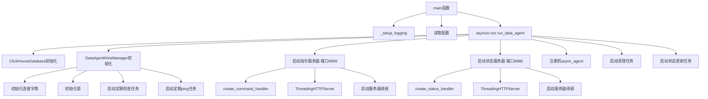

## 2. HTTP请求处理流程

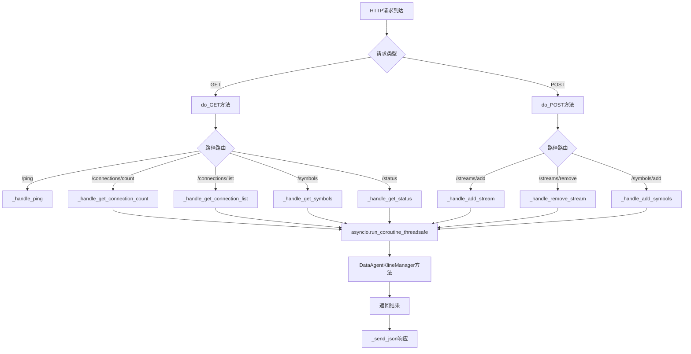

## 3. 批量添加Symbol完整流程

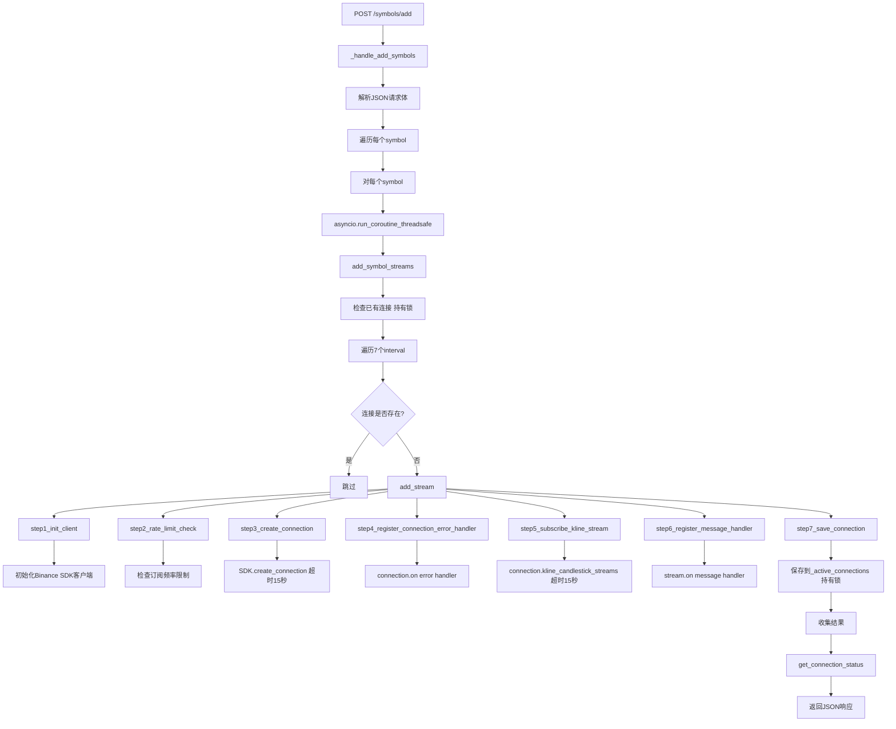

## 4. 添加单个流 (add_stream) 详细流程

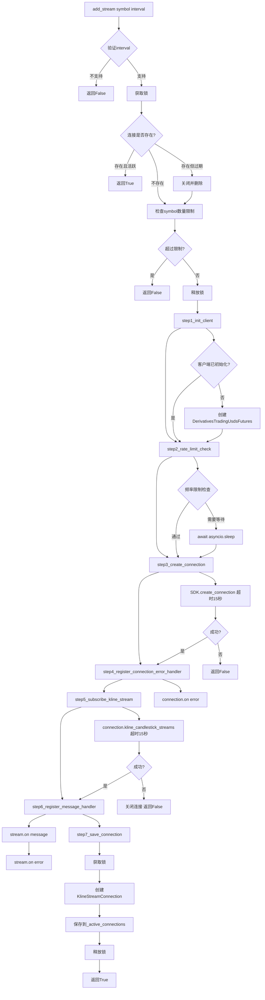

## 5. K线消息处理流程

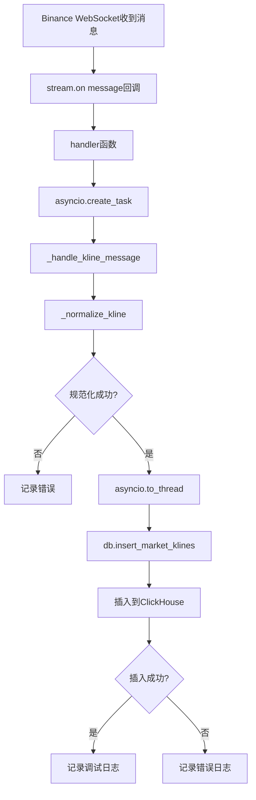

## 6. 连接清理流程

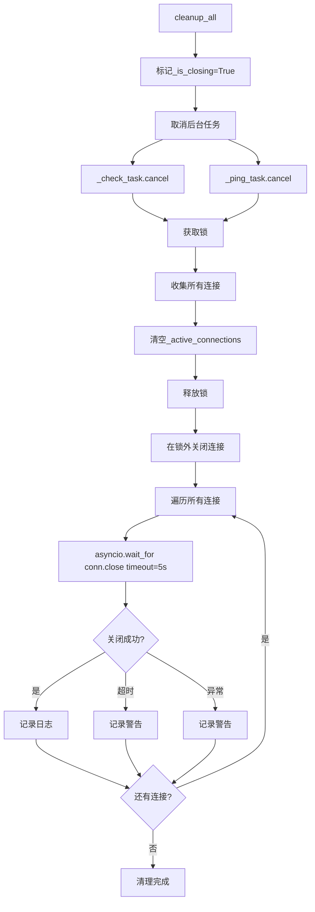

## 7. 定期任务流程

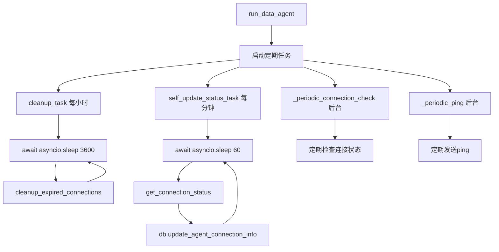

## 8. 错误处理流程

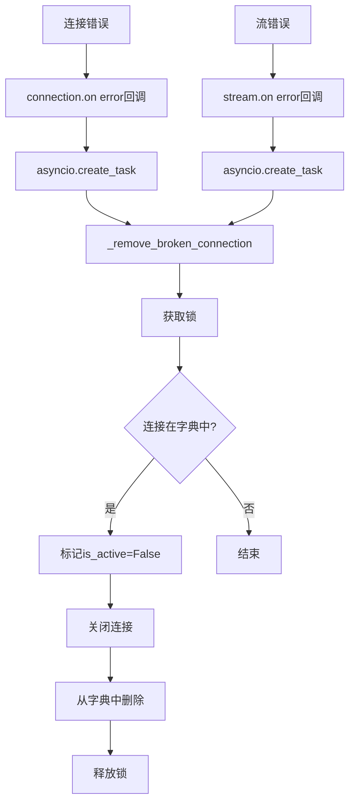

## 9. 服务端口架构

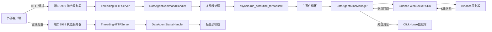

## 10. 数据流图

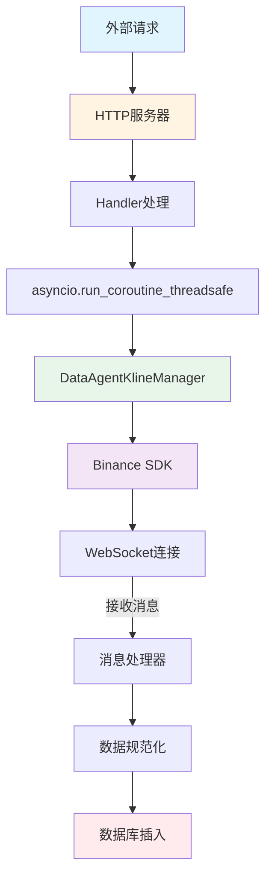

## 11. 并发处理模型

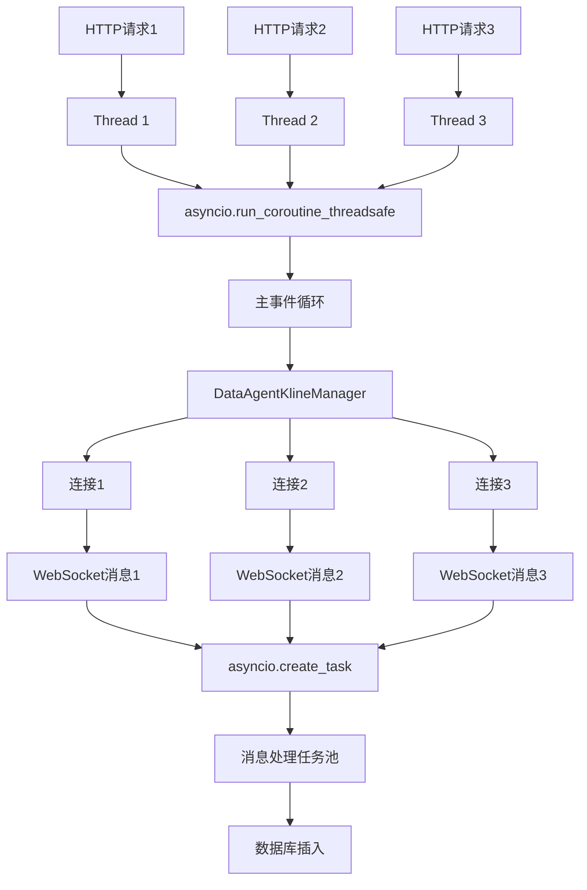

## 12. 锁机制使用

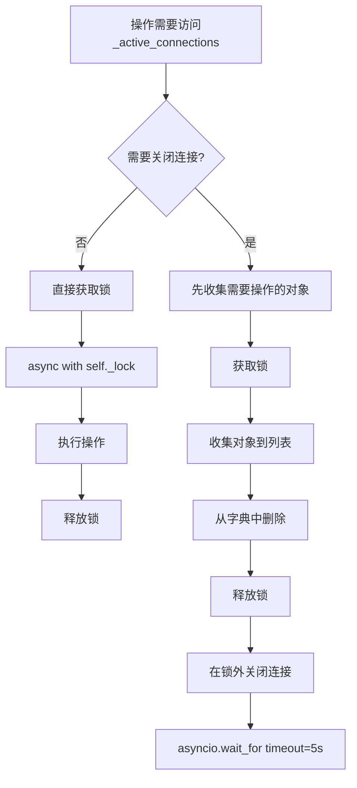

---

## 关键调用链总结

### 1. 服务启动链
```
main() 
  → run_data_agent() 
    → 初始化管理器 
    → 启动HTTP服务器 
    → 启动后台任务
```

### 2. 添加Symbol链
```
POST /symbols/add 
  → _handle_add_symbols() 
    → add_symbol_streams() 
      → add_stream() 
        → step1-7 (7个步骤)
```

### 3. 消息处理链
```
WebSocket消息 
  → stream.on("message") 
    → _handle_kline_message() 
      → _normalize_kline() 
        → db.insert_market_klines()
```

### 4. 清理资源链
```
cleanup_all() 
  → 取消任务 
    → 收集连接 
      → 在锁外关闭连接
```

