# Data Agent 调用链 PlantUML 时序图

本文档包含 Data Agent 系统的 PlantUML 时序图，便于查看和编辑。

---

## 1. 系统启动流程

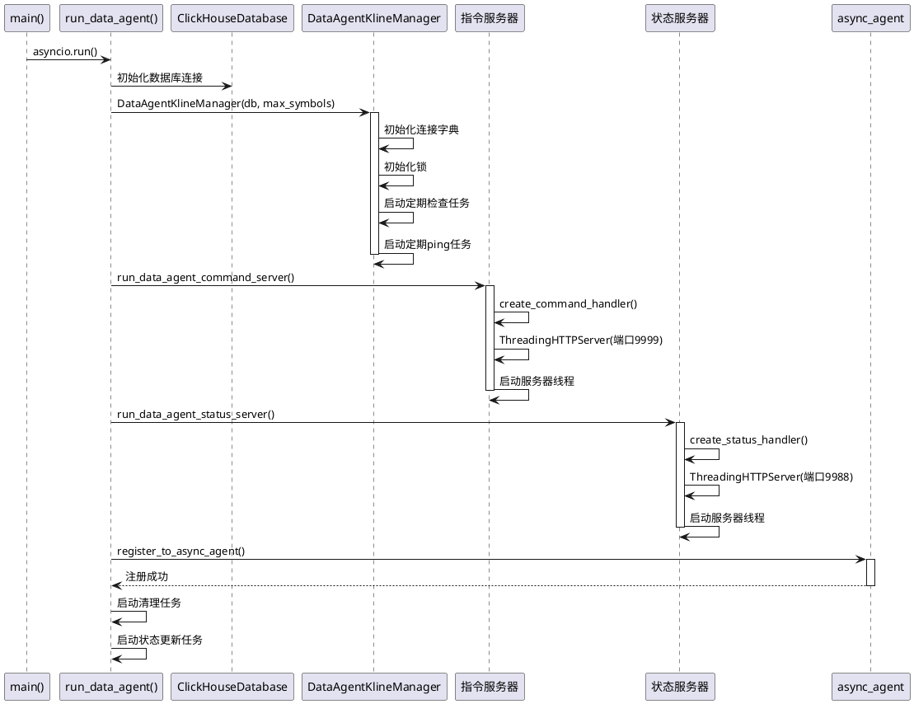

---

## 2. HTTP GET 请求处理流程

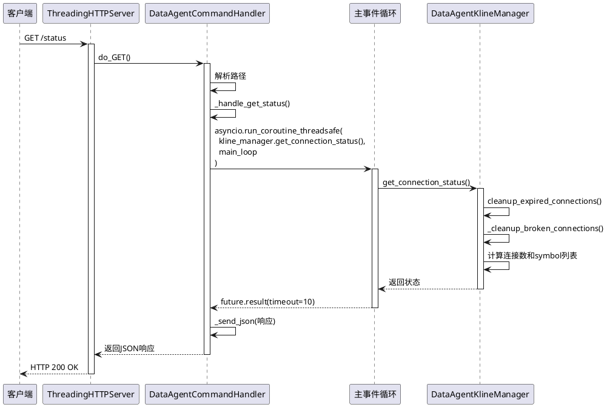

---

## 3. HTTP POST 请求处理流程（批量添加Symbol）

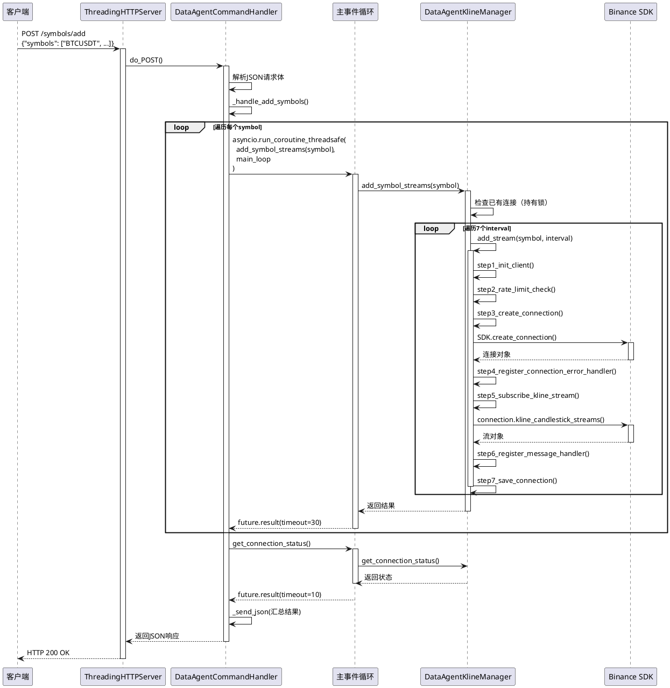

---

## 4. 添加单个流 (add_stream) 详细流程

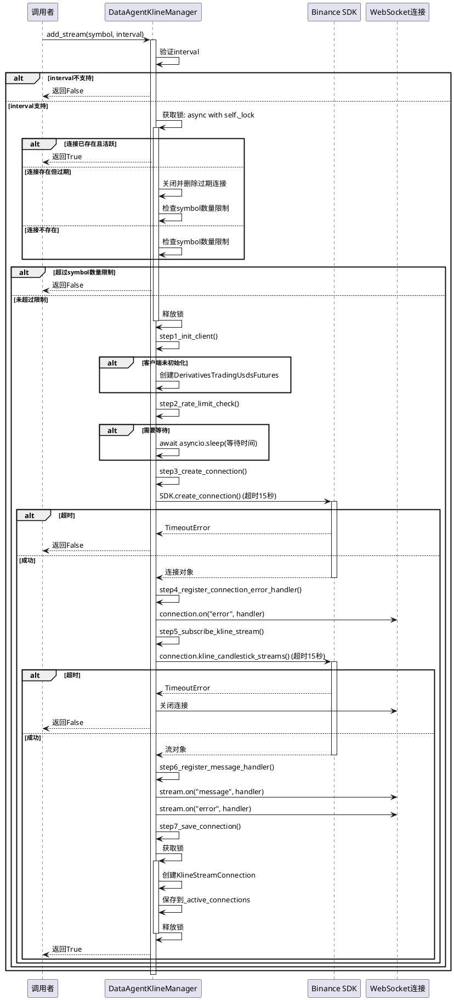

---

## 5. K线消息处理流程

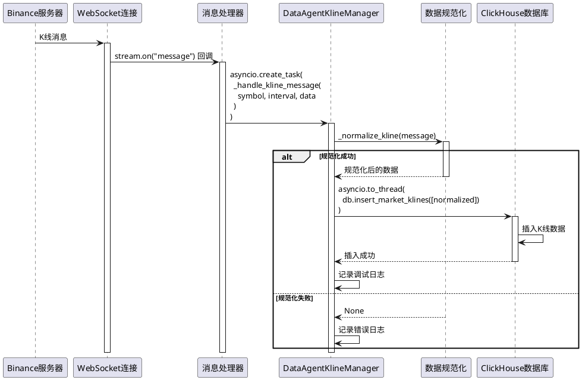

---

## 6. 连接清理流程

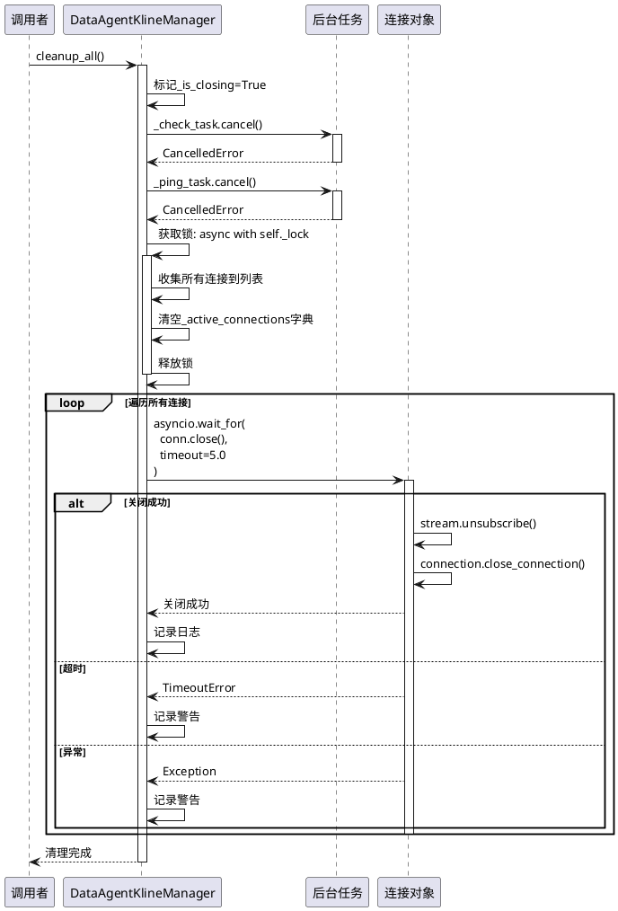

---

## 7. 错误处理流程（连接错误）

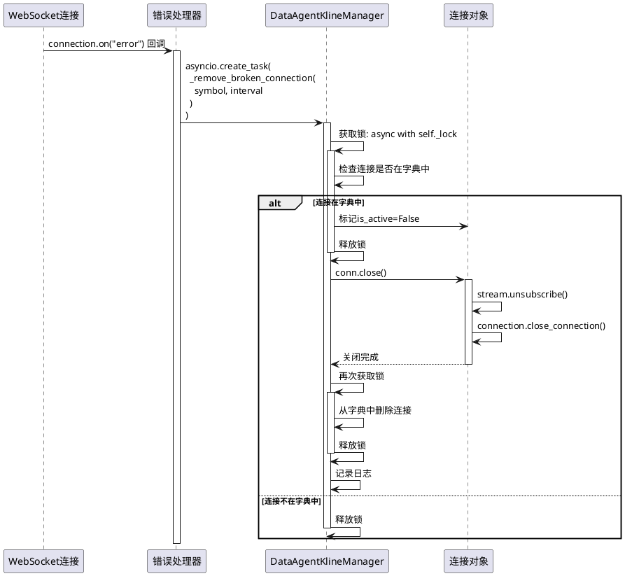

---

## 8. 批量添加Symbol完整流程（简化版）

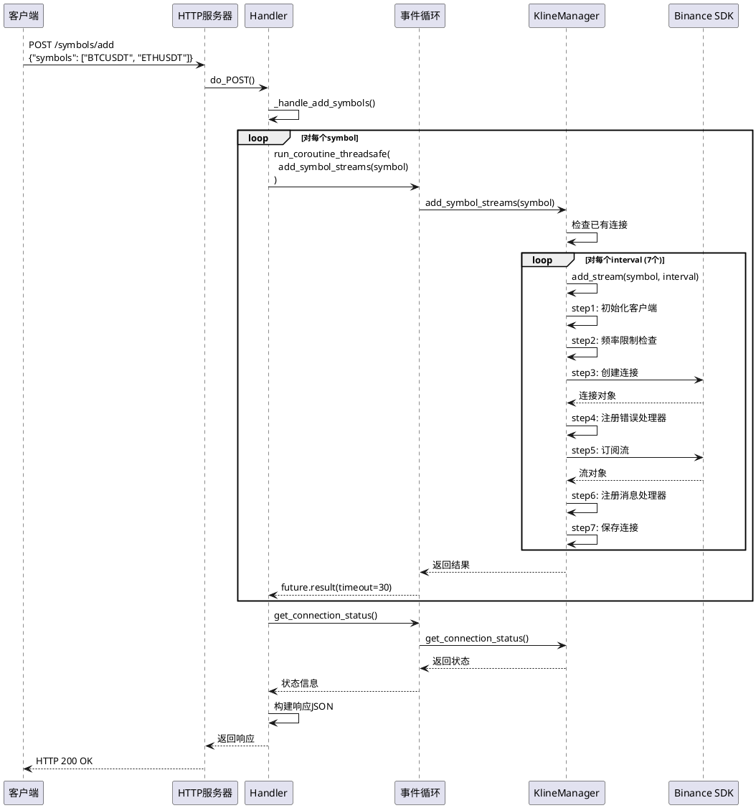

---

## 9. 定期任务流程

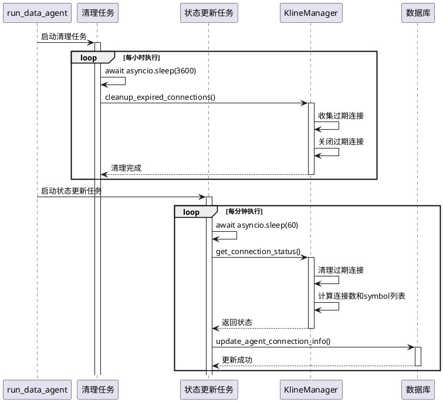

---

## 10. 服务端口架构

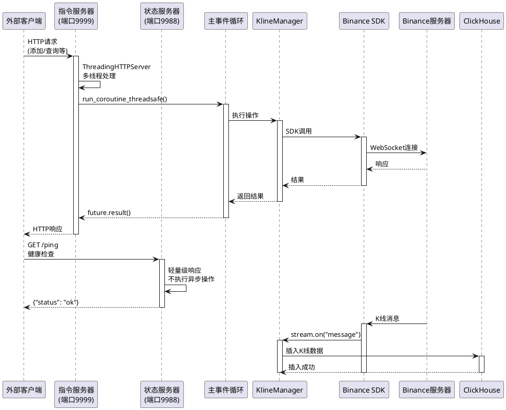

---

## 11. 并发处理模型

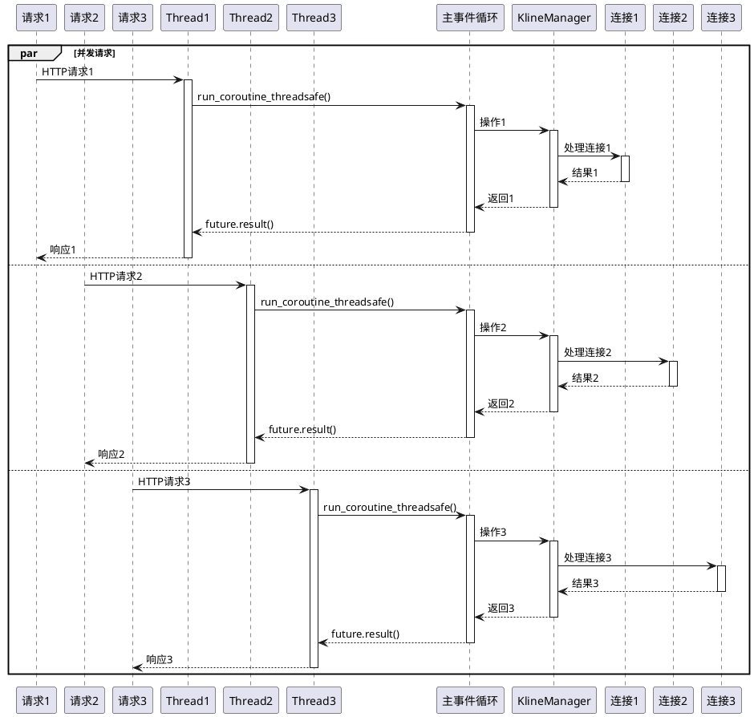

---

## 12. 锁机制使用

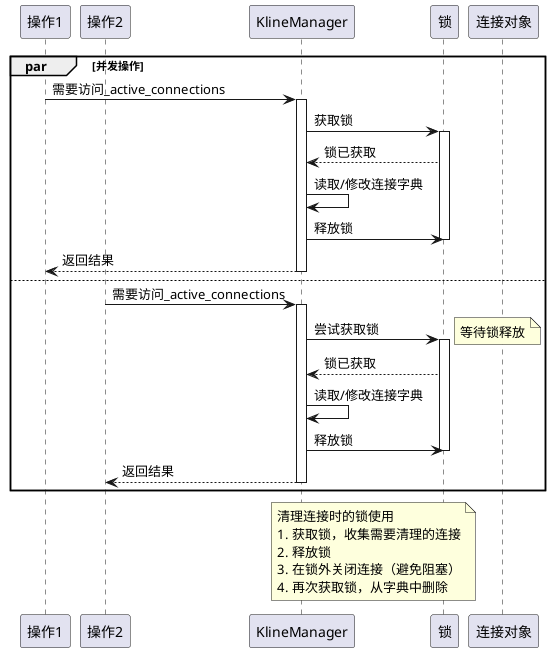

---

## 使用说明

### 如何查看这些图表

1. **在线查看**：
   - 访问 http://www.plantuml.com/plantuml/uml/
   - 复制代码块中的 PlantUML 代码
   - 粘贴到在线编辑器中查看

2. **VS Code 插件**：
   - 安装 "PlantUML" 插件
   - 打开 `.puml` 文件或 Markdown 文件
   - 使用预览功能查看图表

3. **本地工具**：
   - 安装 PlantUML：`brew install plantuml` (Mac) 或下载 jar 文件
   - 使用命令行：`plantuml diagram.puml`
   - 生成 PNG 或 SVG 图片

### 图表说明

- **系统启动流程**：展示服务启动的完整过程
- **HTTP请求处理**：展示HTTP请求如何被处理
- **批量添加Symbol**：展示批量添加的详细流程
- **添加单个流**：展示单个流添加的所有步骤
- **K线消息处理**：展示消息从接收到存储的流程
- **连接清理**：展示资源清理的过程
- **错误处理**：展示错误发生时的处理流程
- **定期任务**：展示后台任务的执行
- **服务端口架构**：展示整体架构
- **并发处理**：展示多线程并发处理
- **锁机制**：展示锁的使用方式

### 编辑建议

如果需要修改图表：
1. 复制对应的 PlantUML 代码
2. 在 PlantUML 编辑器中编辑
3. 查看实时预览
4. 修改后更新文档

---

## 与 Mermaid 图表的对应关系

| PlantUML 图表 | Mermaid 图表 | 说明 |
|--------------|-------------|------|
| 系统启动流程 | 系统启动流程 | 对应关系 |
| HTTP GET请求处理 | HTTP请求处理流程 | 对应关系 |
| HTTP POST批量添加 | 批量添加Symbol完整流程 | 对应关系 |
| 添加单个流详细流程 | 添加单个流详细流程 | 对应关系 |
| K线消息处理流程 | K线消息处理流程 | 对应关系 |
| 连接清理流程 | 连接清理流程 | 对应关系 |
| 错误处理流程 | 错误处理流程 | 对应关系 |
| 定期任务流程 | 定期任务流程 | 对应关系 |
| 服务端口架构 | 服务端口架构 | 对应关系 |
| 并发处理模型 | 并发处理模型 | 对应关系 |
| 锁机制使用 | 锁机制使用 | 对应关系 |

---

## 总结

PlantUML 时序图提供了更详细的交互视图，特别适合：
- 展示方法调用顺序
- 展示异步操作的执行流程
- 展示并发处理的时序关系
- 展示错误处理的流程

这些图表可以与 Mermaid 图表互补使用，提供不同视角的系统视图。

